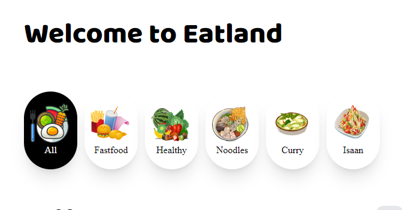
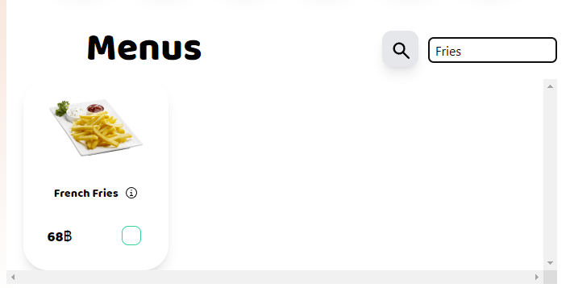
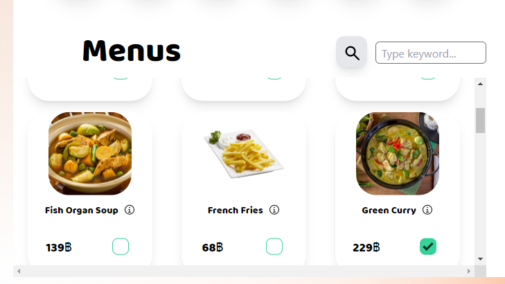
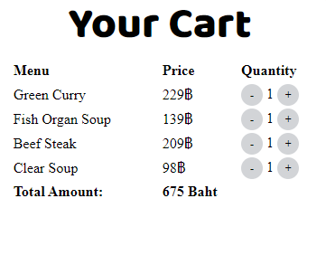

# PROJECT1-SEC-2-FuiYohHaiYaaa

>รายชื่อสมาชิก
* วทัญญู โฉมศรี 64130500072
* สุรเชษฏ์ พิชัยวัฒนพร 64130500087 
* ศุภกร ฉัตรอโณทัย 64130500111
* วชิรวิทย์ จิตพิทยากุล 64130500122

>รายการฟีเจอร์
1. <ins>เลือกประเภทของอาหาร</ins> โดยเบื้องต้นจะมีอยู่ 5 ประเภท และแสดงรายการอาหารตามประเภท
 
2. <ins>พิมพ์ค้นหาชื่ออาหาร</ins> user สามารถกดที่ปุ่มแว่นขยาย เพื่อเปิดแถบสำหรับการพิมพ์ค้นหาชื่ออาหารได้

3. <ins>การเลือกอาหารที่ต้องการ</ins> โดยการกดติ๊กเลือกในช่อง checkbox เมื่อติ๊กแล้ว จะแสดงรายการที่เลือกในแถบ Your cart และคำนวณยอดการสั่งซื้อ

>คู่มือ/วิธีการใช้งาน

1. เมื่อ user เข้ามาบน App เพื่อสั่งอาหาร user ต้องเลือกประเภทของอาหารที่ตนจะรับประทาน
2. หลังจากเลือกประเภทแล้ว App จะแสดงรายการอาหารตามประเภทที่เลือก โดยจะแสดงรายละเอียดเป็น ชื่อ, ราคา และช่องสำหรับติ๊กเพื่อเลือกซื้อ
3. ถ้าหาก user ต้องการหารายการอาหาร สามารถกดไอคอนแว่นขยายเพื่อเปิดแถบค้นหา และพิมพ์หาอาหารตามชื่อได้
4. เมื่อต้องหารเลือกซื้อและสั่งอาหาร user สามารถติ๊กเลือกอาหารจากช่องสี่เหลี่ยมด้านขวาล่างได้
5. จากนั้นรายการอาหารที่เลือกไว้ จะไปแสดงที่บริเวณด้านขวาของ App ในแถบ Your cart ซึ่งจะแสดง ชื่ออาหาร, ราคา, จำนวนตามที่เลือก และมีการคำนวณยอดการสั่งซื้อไว้ให้

>แหล่งข้อมูลอ้างอิง
* ไอเดียในการออกแบบและคิด UX/UI ของตัว app [Anastasia Golovko](https://dribbble.com/shots/14803442-Food-Delivery-service-App-Design)
